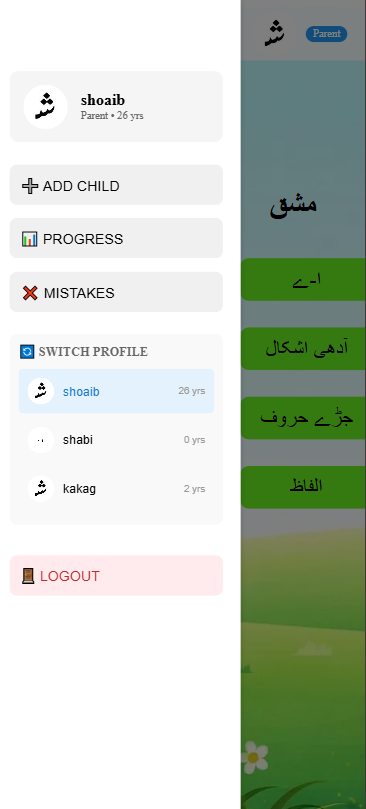
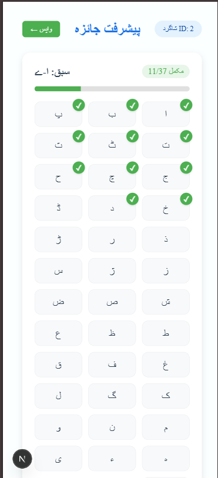
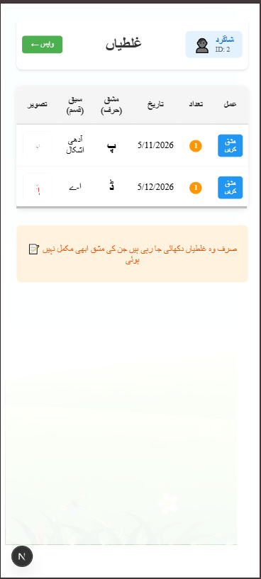

# FYP_Childern-Urdu-Handwriting-Assistant
Interactive Urdu handwriting practice for children with ML-based letter recognition, mistake detection, progress tracking, and parent-child profile management using Next.js + Django.
# 📝 Urdu Handwriting Assistant

> **Final Year Project** – An AI-powered web application for children to learn and practice Urdu handwriting with real-time feedback.

---

## 🎯 **Project Overview**

Urdu Handwriting Assistant is a complete learning system designed to help children master Urdu handwriting. The application provides:

- ✍️ **Tracing Practice** – Interactive canvas with guided tracing of Urdu letters.
- 🤖 **AI Recognition** – Real-time feedback using Machine Learning (CNN) and OCR.
- 👨‍👩‍👦 **Parent Dashboard** – Manage multiple children, track progress, and review mistakes.
- 📊 **Progress Tracking** – Detailed analytics per child, per letter.
- ❌ **Mistake Analysis** – Visual feedback on errors with practice recommendations.

---

## 🛠️ **Tech Stack**

### Frontend
- **Framework:** Next.js 16 (App Router)
- **Styling:** Tailwind CSS
- **Canvas Drawing:** HTML5 Canvas API
- **State Management:** React useState + useEffect

### Backend
- **Framework:** Django 6 + Django REST Framework
- **Database:** PostgreSQL
- **Authentication:** Token-based (DRF Token Authentication)
- **ML/OCR:** CNN (TensorFlow) + PaddleOCR + EasyOCR

### DevOps & Deployment
- **Version Control:** Git + GitHub (Private Repo)
- **Hosting:** Docker + AWS EC2 (or Vercel for frontend, Railway for backend)

---

## 📸 **Screenshots**

  
  

  
  

> *Screenshots are located in the `/screenshots` folder.*

---

## 📁 **Project Structure**
